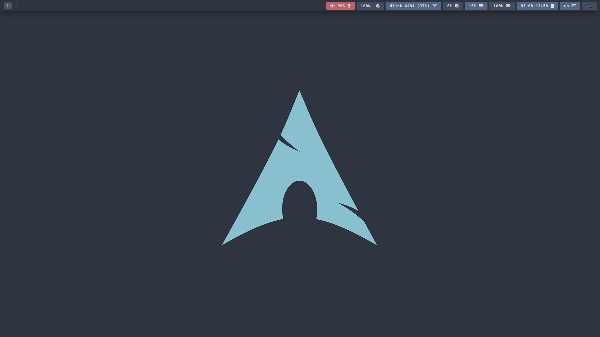

# SwayFX Dotfiles
Dotfiles for SwayFX WM with a focus on the Nord colorscheme

Requirements (Arch Linux):
swayfx, adobe-source-code-pro-fonts, font-awesome, nerd-fonts, swaybg, swaylock, wofi, foot, mako, brightnessctl, clipman, grim, slurp, waybar are the main ones.

pkglist.txt contains a complete list of packages.

